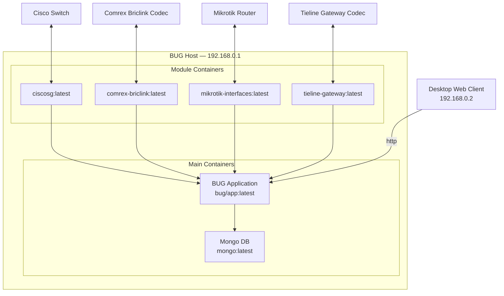

# Containers

## Containers Overview

Every BUG instance includes at minimum:

- BUG Core – serves the frontend UI, manages configuration, and orchestrates modules.
- Mongo – stores persistent configuration and module data.

In development environments, additional containers such as Mongo Express may be present for easier inspection of the database.

Each module is allocated its own container, which provides:

- Isolated environment for backend logic
- Data acquisition and monitoring for connected devices
- REST APIs and WebSocket endpoints for communication with the core
