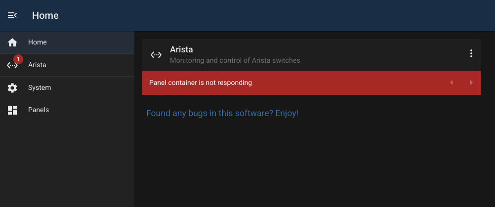
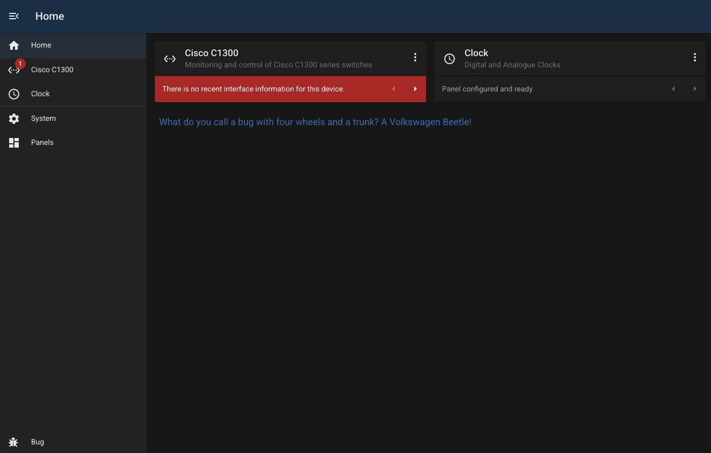
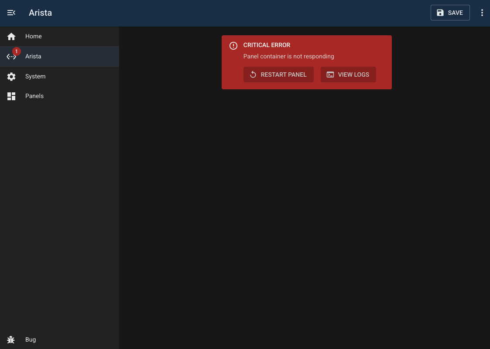
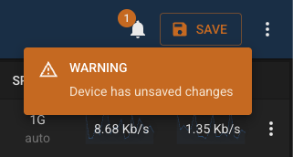

# Panel Status

Each module exposes an API endoint `/status` used to report panel status. This reponse can include one or more StatusItems which are displayed in the UI.

Here's an example:

```
{
  "status": "success",
  "data": [
    {
      "title": null,
      "key": "staleinterfacesdata",
      "message": [
        "There is no recent interface information for this device."
      ],
      "type": "error",
      "timestamp": 1770104973241,
      "flags": [
        "restartPanel",
        "configurePanel"
      ]
    },
    {
      "title": null,
      "key": "stalevlansdata",
      "message": "VLAN information is out of date.",
      "type": "warning",
      "timestamp": 1770104973241,
      "flags": []
    },
    {
      "title": null,
      "key": "description",
      "message": "Switch model C1300-24FP-4X active and running",
      "type": "default",
      "timestamp": 1770104973245,
      "flags": []
    }
  ]
}
```

## Fields

| Field       | Description                                                         |
| ----------- | ------------------------------------------------------------------- |
| `title`     | Optional title. If not provided then the type is used.              |
| `key`       | A key to identify each status item.                                 |
| `message`   | A string, or array of strings containing the description            |
| `type`      | One of "critical", "error", "warning", "info", "success", "default" |
| `timestamp` | Javascript timestamp of the date last updated                       |
| `flags`     | Optional array of flags to use (see below)                          |

### Flags

Setting any of these flags will show an action button when the panel is displayed, allowing the user to act on the problem.

| Name             | Action                                      |
| ---------------- | ------------------------------------------- |
| `restartPanel`   | Restarts the panel container                |
| `configurePanel` | Redirects the user to the panel config page |
| `viewPanelLogs`  | Shows the panel logs                        |

## Home Page

Any status items are shown underneath each Panel Tile on the home page.



> NOTE: Modules which don't use containers cannot change their status (see clock module below)



## Panel Page

If the panel contains critical panel status items, then these are shown in place of the module's content.



## Toolbar

Any non-critical status items are displayed on the toolbar.


