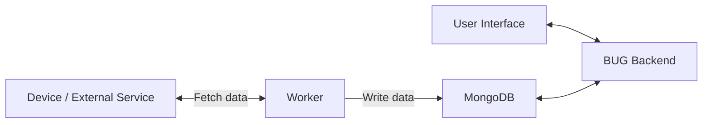

# Module Data Management

This page explains how modules fetch, store, and manage their data in BUG. It covers workers, database usage, helper modules, and best practices.

---

## Fetching Data from Devices

Modules use **workers** to fetch data from external devices or services. Example methods might include:

-   Web APIs (HTTP/REST)
-   Socket APIs
-   SNMP

Data is fetched by the worker and written to the database. The user interface then reads data from the database. Modules should **never fetch data directly in response to UI requests**, as this is not scalable.

When designing workers:

-   Consider how often you poll each device. Polling too frequently wastes resources; polling too infrequently may make the UI feel stale.
-   Multiple fetch handlers can be combined into a single worker. Each worker spawns a new JavaScript engine, so combining handlers can reduce memory usage.

---

## Storing Module Data

Each module has several options for storing data:

-   Module config for persistent, transferable settings.
-   NodeCache for short-term caching of regularly polled data.
-   BUG MongoDB instance for any other data (not that this not designed to be persistent).

Modules should **not access other panels’ databases or the core BUG database directly**. All cross-panel interactions should use the API.

---

## Database Access Helpers

BUG provides helper modules for interacting with the MongoDB instance:

### mongoDb

Workers should first connect to the database using the panel ID:

```

const mongoDb = require("@core/mongo-db");

// Connect to the database
await mongoDb.connect(workerData.id);

```

### mongo-collection.js

Provides access to individual collections:

```

const mongoCollection = require("@core/mongo-collection");

// Get a collection reference
const interfacesCollection = await mongoCollection("interfaces");
const result = await interfacesCollection.findOne({ "interfaceId": "eth0" });

```

### mongo-single.js

Stores a single document containing an object or array payload:

```

const mongoSingle = require("@core/mongo-single");

// Set data
await mongoSingle.set("leases", ["lease1", "lease2"]);

// Get data
const leases = await mongoSingle.get("leases");

```

Both helpers support **time-to-live (TTL)**, which automatically removes stale data (commonly 60 seconds).

---

## Best Practices

-   Avoid overloading the database; use batched writes or local caching when possible.
-   Poll devices at reasonable intervals; frequent polling is rarely needed.
-   Use TTLs to remove stale data automatically.
-   Ensure collections are cleared on container restart to prevent stale state.

This approach ensures module data is **scalable, reliable, and consistent** while keeping live device data and persistent configuration clearly separated.

---

# Diagram



### Explanation

-   Workers fetch data from devices or external services.
-   Workers write the fetched data directly to MongoDB.
-   The BUG backend reads from MongoDB to serve the UI.
-   The UI communicates only with the BUG backend, never directly with devices or MongoDB.
