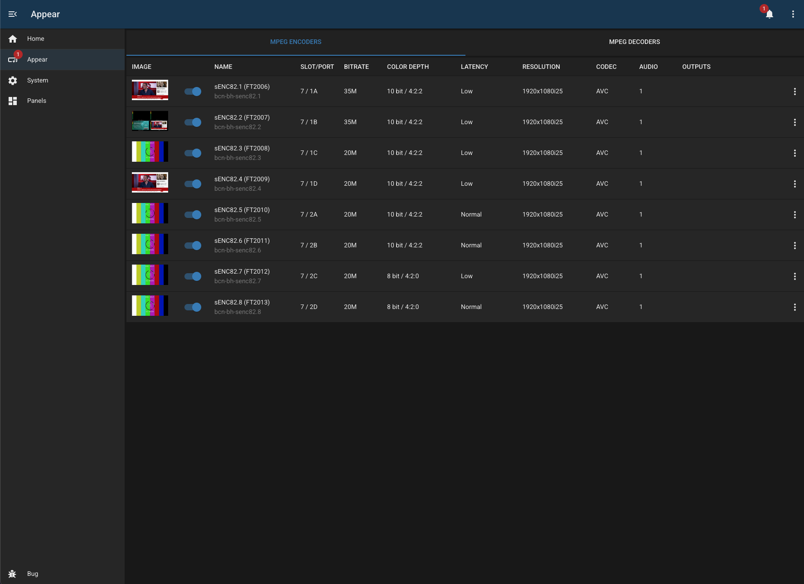

# Appear X

## Overview

This module provides an interface to control multiple encode or decode channels on an Appear X chassis.

The Appear UI can be fiddly to use, and difficult to adjust quickly. With this module you can easily change bitrate, colour space, audio channels, and latency with a couple of clicks.

## Configuration

| Field               | Default Value                                                                                                       | Description                                                              |
| ------------------- | ------------------------------------------------------------------------------------------------------------------- | ------------------------------------------------------------------------ |
| `id`                | `""`                                                                                                                | Unique identifier for this module instance (usually auto-generated).     |
| `needsConfigured`   | `true`                                                                                                              | Indicates whether the module has been configured since build.            |
| `title`             | `""`                                                                                                                | Human-readable title for this module instance, shown in the UI.          |
| `module`            | `"appear-x"`                                                                                                        | Internal name of the module.                                             |
| `description`       | `""`                                                                                                                | Optional text describing the module instance in the UI.                  |
| `notes`             | `""`                                                                                                                | Free-text field for extra notes about this configuration.                |
| `address`           | `""`                                                                                                                | IP address or hostname of the appear chassis                             |
| `username`          | `""`                                                                                                                | Username used to authenticate with the device                            |
| `password`          | `""`                                                                                                                | Password for the user                                                    |
| `protectedServices` | `[]`                                                                                                                | An array of service IDs which are disabled to prevent accidental changes |
| `ignoredAlarms`     | `["Freeze","No input bitrate","No video detected","No audio detected","Video PID missing", "PID missing on input"]` | An array of alarms which are ignored                                     |

---

## Capabilities

This module follows BUG’s standard capabilities model. For more information, see [BUG Capabilities Documentation](https://bbc.github.io/bug/pages/development/capabilities.html).

| Type         | List |
| ------------ | ---- |
| **Exposes**  | None |
| **Consumes** | None |

---

## Device Configuration

- we recommend adding a specific 'BUG' user with write (but not admin) privileges
- BUG assumes that you have a separate video profile defined for each encode and decode service. Sharing them between services will get confusing ...

---

## Troubleshooting

---

## Known Limitations

- This module is still in development.
- The plan is to add MPEG decode, JPEG-XS encode and JPEG-XS decode in the future.
- The API is very fussy. Some specific combinations of settings can cause unpredictable results. Please report any issues via Github.
