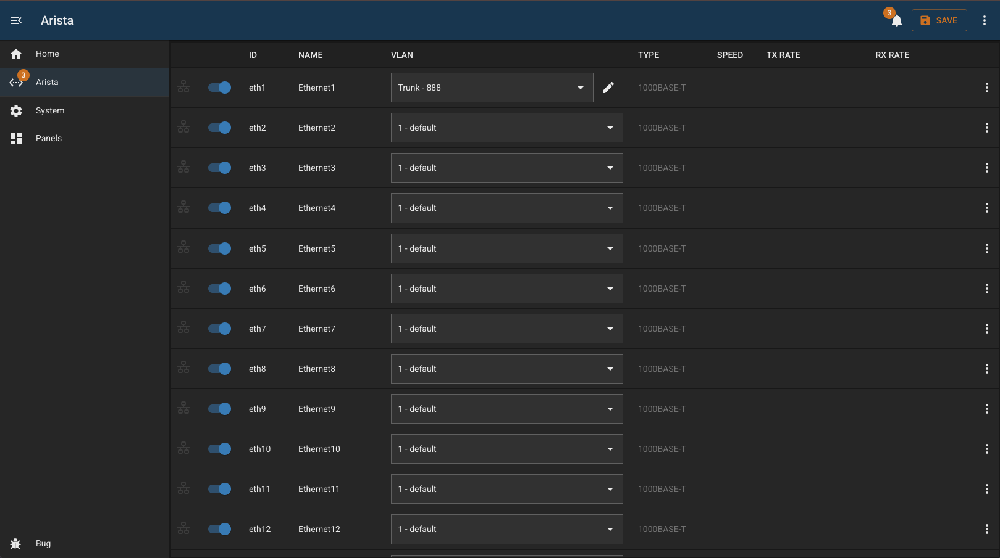
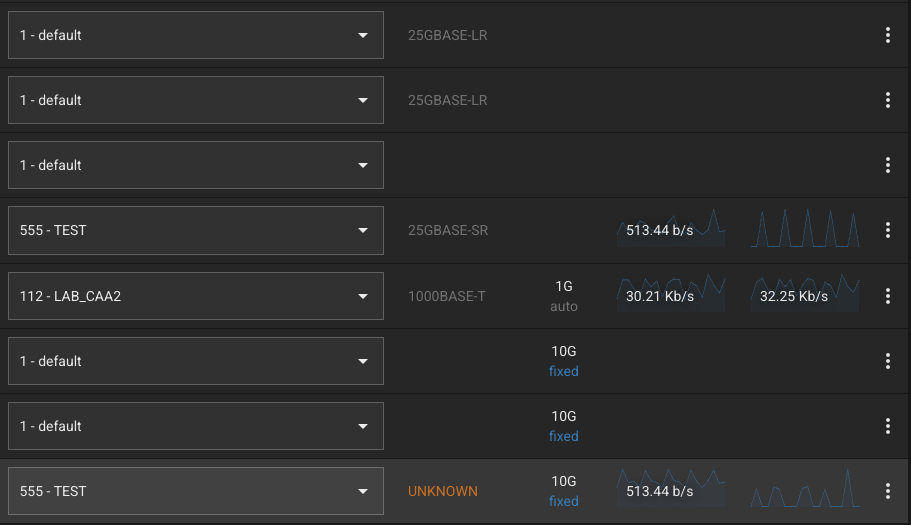
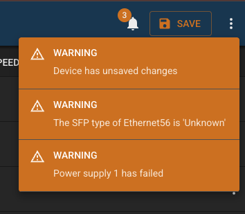

# Arista Switch

## Overview

A module to control and monitor Arista AOS network switches.

Interface list features:

- list of interfaces with bitrate (and recent historical stats)
- ability to enable/disable ports
- view POE status and control power
- add description to interface (click on the name to edit)
- select VLAN, including editing of trunk or access mode
- display of interface rate (1G/100M)
- ablity to 'protect' ports to prevent accidental changes (useful for uplinks etc) - stored locally in BUG
- display of neighbors and/or known devices (LLDP or FDB)
- configurable DHCP address source to convert discovered MAC addresses to IP
- displays if any ports are in 'error-disabled' state

Interface page features:

- more detailed view of interface
- statistics graph for last few minutes
- neighbor details (LLDP)
- devices tab (FDB) with optional IP lookup

Also polls the switch to check if there are pending changes and prompts to save if there are.







## Device Status

This module provides a BUG status endpoint. Read the [Bug Documentation]({DOCS_BASEURL}pages/architecture/panel-status.html) for more information.

| Type      | Description                                            |
| --------- | ------------------------------------------------------ |
| `error`   | Checks contents of interfaces collection in db         |
| `warning` | Checks contents of VLANs collection in db              |
| `warning` | Checks contents of system information collection in db |
| `warning` | Checks error disabled state of interfaces              |
| `warning` | Checks if device has unsaved changes                   |
| `warning` | Checks status of device power supplies                 |
| `warning` | Checks any SFPs in an 'unknown' state                  |

## Configuration

| Field                 | Default Value     | Description                                                          |
| --------------------- | ----------------- | -------------------------------------------------------------------- |
| `id`                  | `""`              | Unique identifier for this module instance (usually auto-generated). |
| `needsConfigured`     | `true`            | Indicates whether the module has been configured since build.        |
| `title`               | `""`              | Human-readable title for this module instance, shown in the UI.      |
| `module`              | `"arista-switch"` | Internal name of the module.                                         |
| `description`         | `""`              | Optional text describing the module instance in the UI.              |
| `notes`               | `""`              | Free-text field for extra notes about this configuration.            |
| `enabled`             | `false`           | Whether the module instance is enabled                               |
| `address`             | `""`              | IP address or hostname of the device to connect to.                  |
| `username`            | `"bug"`           | Username used to authenticate with the device                        |
| `password`            | `""`              | Password for the user                                                |
| `enabled`             | `false`           | Flag indicating whether this module instance is active.              |
| `protectedInterfaces` | `[]`              | An of array of interfaces which are 'protected'                      |
| `dhcpSources`         | `[]`              | An of array panel IDs which provide the dhcp server capability       |

---

## Capabilities

This module follows BUG’s standard capabilities model. For more information, see [BUG Capabilities Documentation]({DOCS_BASEURL}bug/pages/development/capabilities.html).

| Type         | List        |
| ------------ | ----------- |
| **Exposes**  | None        |
| **Consumes** | dhcp-server |

---

## Device Configuration

1. Create a username/password with write access - used for all API access
2. Enable API access by adding the following config:

```
management api http-commands
   protocol https
   no shutdown
```

Check the configuration with this:

```
show management api http-commands
```

You should see something like:

```
- Enabled: Yes
- Protocol: HTTPS
- VRF: management
```

---

## Troubleshooting
