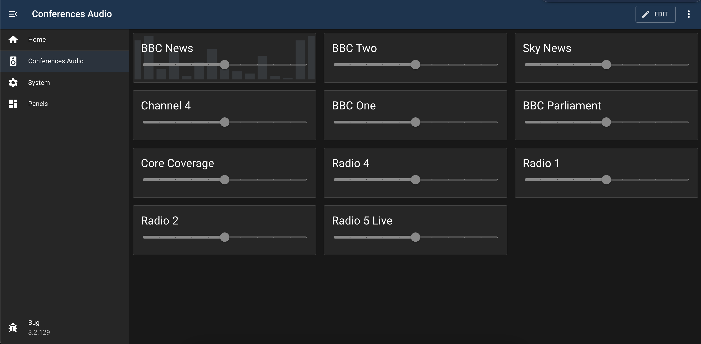

# <ModuleName>

## Overview

Provides multiple web-based audio players in a single page.

Uses https://github.com/cookpete/react-player under the hood and supports all transports/codecs provided by the native `<Audio>` HTML component.

## Configuration

| Field             | Default Value     | Description                                                          |
| ----------------- | ----------------- | -------------------------------------------------------------------- |
| `id`              | `""`              | Unique identifier for this module instance (usually auto-generated). |
| `needsConfigured` | `true`            | Indicates whether the module has been configured since build.        |
| `title`           | `""`              | Human-readable title for this module instance, shown in the UI.      |
| `module`          | `"audio-player"`. | Internal name of the module.                                         |
| `description`     | `""`              | Optional text describing the module instance in the UI.              |
| `notes`           | `""`              | Free-text field for extra notes about this configuration.            |
| `players`         | `{}`              | An object containing configuration for the modules' players          |
| `enabled`         | `false`           | Flag indicating whether this module instance is active.              |
