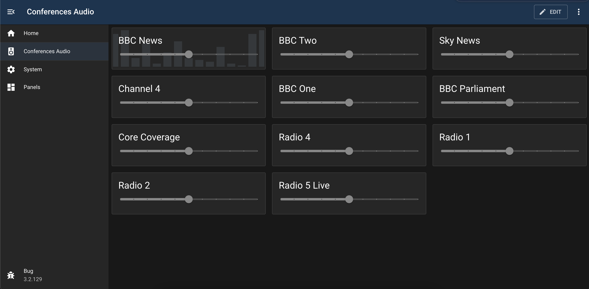

# Audio Player

## Overview

Provides multiple web-based audio players on a single panel, each rendered as a card with its own play/pause control, volume slider and live level animation. It is designed for monitoring several live audio streams (for example radio and TV channel feeds) at a glance.

Playback is handled by [react-player](https://github.com/cookpete/react-player), so any transport/codec supported by the browser's native `<audio>` element works, including HLS (`.m3u8`) live streams. Stream requests are proxied through the module container, avoiding cross-origin restrictions in the browser.

## Features

- Multiple independent players on one panel.
- Per-player play/pause and volume control.
- Live buffering indicator — a card only shows as active once audio is actually playing, not while connecting or buffering.
- Automatic recovery to the idle state if a stream fails to load.
- Streams are only loaded on demand (nothing plays or buffers until you press play).

## How it works

- Each player references a stream `source`. When you press play, the module proxies the stream through `/api/audio/:playerId/...` and begins playback at the live edge.
- Players are mounted only while playing, so no stream is loaded on page load and pausing fully tears the stream down.
- The card reflects the true playback state: a spinner while buffering, and the active (green) styling with an animated level display once audio is flowing.

## Configuration

Instance-level configuration:

| Field             | Default Value    | Description                                                          |
| ----------------- | ---------------- | -------------------------------------------------------------------- |
| `id`              | `""`             | Unique identifier for this module instance (usually auto-generated). |
| `order`           | `0`              | Display order of this module instance in the UI.                     |
| `needsConfigured` | `false`          | Indicates whether the module has been configured since build.        |
| `title`           | `""`             | Human-readable title for this module instance, shown in the UI.      |
| `module`          | `"audio-player"` | Internal name of the module.                                         |
| `description`     | `""`             | Optional text describing the module instance in the UI.              |
| `notes`           | `""`             | Free-text field for extra notes about this configuration.            |
| `players`         | `{}`             | A map of player configurations, keyed by an auto-generated ID.       |
| `enabled`         | `true`           | Flag indicating whether this module instance is active.              |

Each entry in `players` describes a single audio player:

| Field         | Required | Description                                                  |
| ------------- | -------- | ------------------------------------------------------------ |
| `title`       | Yes      | Label shown on the player card.                              |
| `source`      | Yes      | Stream URL to play (for example an HLS `.m3u8` playlist).    |
| `description` | No       | Optional secondary text shown beneath the title on the card. |

Players are managed through the module's edit/config panels rather than by editing the config directly.

## API

The container exposes the following routes (relative to the module container base path):

| Method   | Route                        | Description                                        |
| -------- | ---------------------------- | -------------------------------------------------- |
| `GET`    | `/api/players`               | List all configured players.                       |
| `GET`    | `/api/players/:playerId`     | Get a single player's configuration.               |
| `POST`   | `/api/players`               | Add a player (`title` and `source` are required).  |
| `PUT`    | `/api/players/:playerId`     | Update an existing player.                         |
| `DELETE` | `/api/players/:playerId`     | Remove a player.                                   |
| `GET`    | `/api/audio/:playerId/:file` | Proxy the player's stream (playlist and segments). |
| `GET`    | `/api/status`                | Module status.                                     |
| `GET`    | `/api/config`                | Get the module instance configuration.             |
