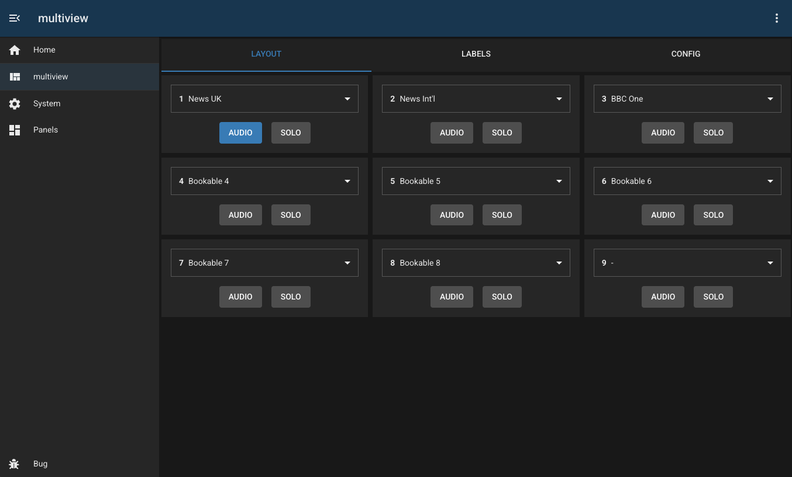
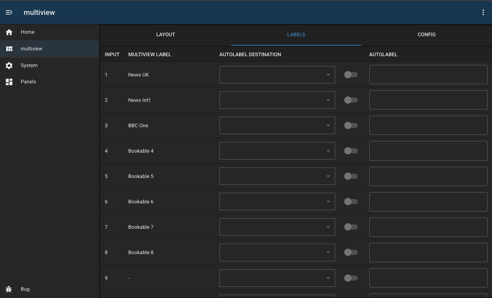
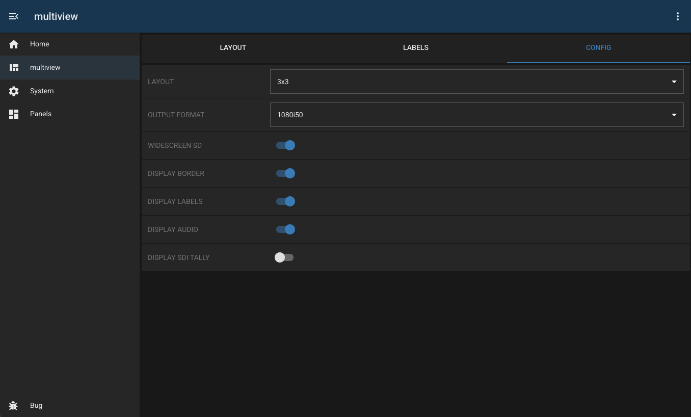

# Blackmagic MultiView 16

## Overview

This module allows configuration of a Blackmagic multiview 16.

Handy features:

- easy routing of inputs to specific PIPs
- ability to switch between UK-style and US-style layouts (1,2,3, or 1,4,9)
- integration with video routers (allowing automatic label updates)

## Configuration

| Field              | Default Value      | Description                                                                   |
| ------------------ | ------------------ | ----------------------------------------------------------------------------- |
| `id`               | `""`               | Unique identifier for this module instance (usually auto-generated).          |
| `needsConfigured`  | `true`             | Indicates whether the module has been configured since build.                 |
| `title`            | `""`               | Human-readable title for this module instance, shown in the UI.               |
| `module`           | `"mikrotik-sdwan"` | Internal name of the module.                                                  |
| `description`      | `""`               | Optional text describing the module instance in the UI.                       |
| `notes`            | `""`               | Free-text field for extra notes about this configuration.                     |
| `address`          | `""`               | IP address or hostname of the device to connect to.                           |
| `port`             | `9990`             | Port used to connect to the device                                            |
| `autoLabelSource`  | `null`             | ID of a panel providing a video router capability                             |
| `autoLabelEnabled` | `[]`               | An array which stores which PIPs have their 'auto label ' function enabled    |
| `autoLabelIndex`   | `{}`               | An object containing the mapping of PIP to router destination for auto labels |
| `enabled`          | `false`            | Flag indicating whether this module instance is active.                       |

---

## Capabilities

This module follows BUG’s standard capabilities model. For more information, see [BUG Capabilities Documentation](https://bbc.github.io/bug/pages/development/capabilities.html).

| Type         | List         |
| ------------ | ------------ |
| **Exposes**  |              |
| **Consumes** | video-router |

---

## Device Configuration

None required. Blackmagic devices don't use usernames or passwords!
We recommend NATing or ACLing this device to other users.

---

## Troubleshooting
