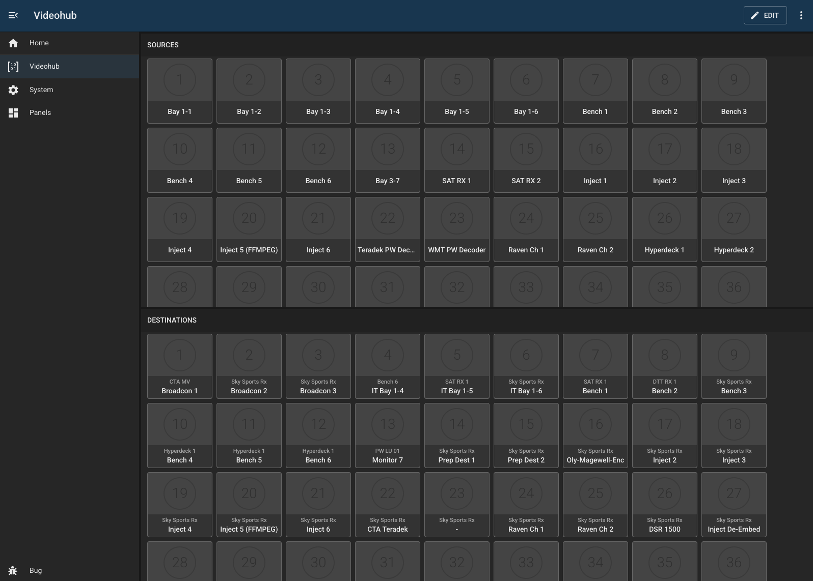
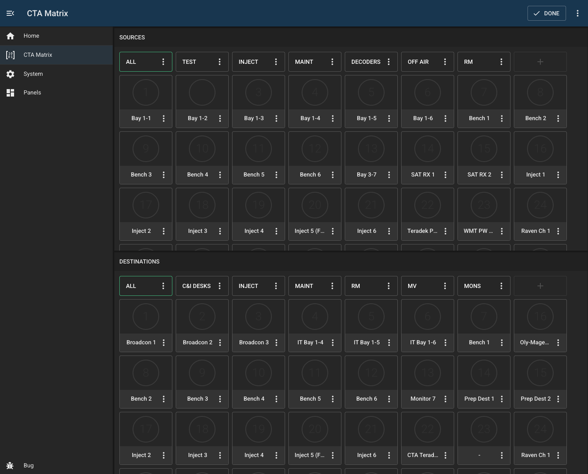
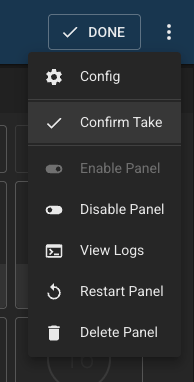

# Appear X

## Overview

This module provides control of Blackmagic videohub routers.

Features:

- uses the stored labels from the device
- provides custom groups (stored in BUG)
- add/remove groups
- reorder groups (drag/drop)
- reorder buttons in groups
- an optional 'use take' setting which requires two clicks to take a route
- customisable colours and icons for all buttons
- uses the device destination 'lock' feature

### UHD Quad-3G

An extra option has been added when the device is being used in UHD Quad-3D mode. Enabling 'quad' on a destination or source routes all 4 members of that group at the same time.
Note that this can only be enabled for buttons 1,5,9 etc. To make things simpler, you can create a group with only the first buttons of each group visible.

## Screenshots

## Configuration

| Field                   | Default Value    | Description                                                          |
| ----------------------- | ---------------- | -------------------------------------------------------------------- |
| `id`                    | `""`             | Unique identifier for this module instance (usually auto-generated). |
| `needsConfigured`       | `true`           | Indicates whether the module has been configured since build.        |
| `title`                 | `""`             | Human-readable title for this module instance, shown in the UI.      |
| `module`                | `"bmd-videohub"` | Internal name of the module.                                         |
| `description`           | `""`             | Optional text describing the module instance in the UI.              |
| `notes`                 | `""`             | Free-text field for extra notes about this configuration.            |
| `enabled`               | `false`          | Whether the module instance is enabled                               |
| `address`               | `""`             | IP address or hostname of the device                                 |
| `port`                  | `9990`           | Port used to communicate with the device                             |
| `useTake`               | `false`          | Whether to require an extra 'take' action when making routes         |
| `sourceGroups`          | `[]`             | An array storing the configuration of the source groups              |
| `destinationGroups`     | `[]`             | An array storing the configuration of the destination groups         |
| `sourceIconColors`      | `[]`             | An array storing the configuration of the source icon colors         |
| `destinationIconColors` | `[]`             | An array storing the configuration of the destination icon colors    |
| `sourceIcons`           | `[]`             | An array storing the configuration of the source icons               |
| `destinationIcons`      | `[]`             | An array storing the configuration of the source icons               |
| `excludeSources`        | `[]`             | An array containing all source indexes to exclude from the UI        |
| `excludeDestinations`   | `[]`             | An array containing all destination indexes to exclude from the UI   |

---

## Capabilities

This module follows BUG’s standard capabilities model. For more information, see [BUG Capabilities Documentation](https://bbc.github.io/bug/pages/development/capabilities.html).

| Type         | List         |
| ------------ | ------------ |
| **Exposes**  | video-router |
| **Consumes** | None         |

---

## Device Configuration

None required. Blackmagic devices don't use usernames or passwords!
We recommend NATing or ACLing this device to other users.

---

## Troubleshooting
