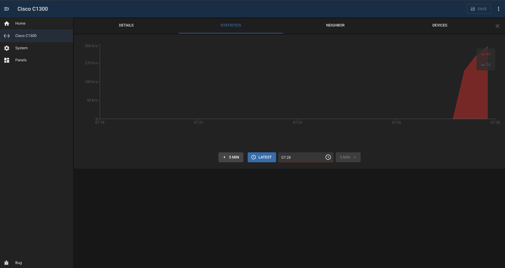

# Cisco C1300

## Overview

A module to control and monitor Cisco C1300-series switches.

Main list features:

- list of interfaces with bitrate (and recent historical stats)
- ability enable/disable ports
- view POE status and control power
- add description to interface (click on the name to edit)
- select VLAN, including editing of trunk or access mode
- display of interface rate (1G/100M)
- ablity to 'protect' ports to prevent accidental changes (useful for uplinks etc) - stored locally in BUG
- display of neighbor (LLDP or CDB)
- configurable DHCP address source to convert discovered MAC addresses to IP

Interface page features:

- more detailed view of interface
- statistics graph for last few minutes
- neighbor details (LLDP)
- devices tab (CDB) with optional IP lookup

Also polls the switch to check if there are pending changes and prompts to save if there are.

Also checks the device to see if the password has expired - this is a common cause of problems.

## Configuration

| Field                 | Default Value   | Description                                                          |
| --------------------- | --------------- | -------------------------------------------------------------------- |
| `id`                  | `""`            | Unique identifier for this module instance (usually auto-generated). |
| `needsConfigured`     | `true`          | Indicates whether the module has been configured since build.        |
| `title`               | `""`            | Human-readable title for this module instance, shown in the UI.      |
| `module`              | `"cisco-c1300"` | Internal name of the module.                                         |
| `description`         | `""`            | Optional text describing the module instance in the UI.              |
| `notes`               | `""`            | Free-text field for extra notes about this configuration.            |
| `enabled`             | `false`         | Whether the module instance is enabled                               |
| `address`             | `""`            | IP address or hostname of the device to connect to.                  |
| `username`            | `"bug"`         | Username used to authenticate with the device                        |
| `password`            | `""`            | Password for the user                                                |
| `enabled`             | `false`         | Flag indicating whether this module instance is active.              |
| `snmpCommunity`       | `public`        | SNMP community with write access to the device                       |
| `protectedInterfaces` | `[]`            | An of array of interfaces which are 'protected'                      |
| `dhcpSources`         | `[]`            | An of array panel IDs which provide the dhcp server capability       |

---

## Capabilities

This module follows BUG’s standard capabilities model. For more information, see [BUG Capabilities Documentation](https://bbc.github.io/bug/pages/development/capabilities.html).

| Type         | List        |
| ------------ | ----------- |
| **Exposes**  | None        |
| **Consumes** | dhcp-server |

---

## Device Configuration

- Create a username/password with write access - used to ssh into the device for the pending status
- Create an SNMP community with write access - used for all other actions

---

## Troubleshooting
