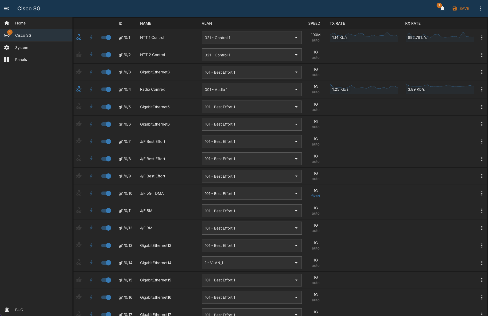

# Cisco SG

## Overview

A module to monitor and control Cisco SG-series switches.

Interface list features:

- list of interfaces with bitrate and recent historical stats
- ability to enable and disable ports
- view and update interface descriptions
- select VLAN mode (access or trunk) and update VLAN membership
- display of negotiated and configured interface speeds
- ability to protect interfaces from accidental changes
- display of neighbors and known devices (LLDP and FDB)
- optional DHCP source panels to enrich discovered MAC addresses with IP details

Interface page features:

- detailed per-interface view
- statistics graph for recent traffic history
- neighbor details (LLDP)
- devices tab (FDB) with optional IP lookup

Status checks include:

- heartbeat (module connectivity)
- stale interface, VLAN, and system data detection
- pending configuration detection
- password-expired detection

## Configuration

| Field                 | Default Value | Description                                                          |
| --------------------- | ------------- | -------------------------------------------------------------------- |
| `id`                  | `""`          | Unique identifier for this module instance (usually auto-generated). |
| `order`               | `0`           | Display order for this module instance.                              |
| `needsConfigured`     | `true`        | Indicates whether the module has been configured since build.        |
| `title`               | `""`          | Human-readable title shown in the UI.                                |
| `module`              | `"cisco-sg"`  | Internal name of the module.                                         |
| `description`         | `""`          | Optional text describing this module instance.                       |
| `notes`               | `""`          | Free-text field for extra operational notes.                         |
| `enabled`             | `false`       | Whether this module instance is active.                              |
| `address`             | `""`          | IP address or hostname of the switch.                                |
| `username`            | `"bug"`       | SSH username used for CLI-based actions and checks.                  |
| `password`            | `""`          | SSH password for the configured user.                                |
| `snmpCommunity`       | `public`      | SNMP community string with write access.                             |
| `protectedInterfaces` | `[]`          | List of interface IDs protected from accidental changes.             |
| `dhcpSources`         | `[]`          | List of panel IDs that expose the `dhcp-server` capability.          |

---

## Capabilities

This module follows BUG's standard capabilities model. For more information, see [BUG Capabilities Documentation]({DOCS_BASEURL}bug/pages/development/capabilities.html).

| Type         | List        |
| ------------ | ----------- |
| **Exposes**  | None        |
| **Consumes** | dhcp-server |

---

## Device Configuration

- Create a username and password with write access for SSH actions.
- Create an SNMP community with write access for monitoring and control.
