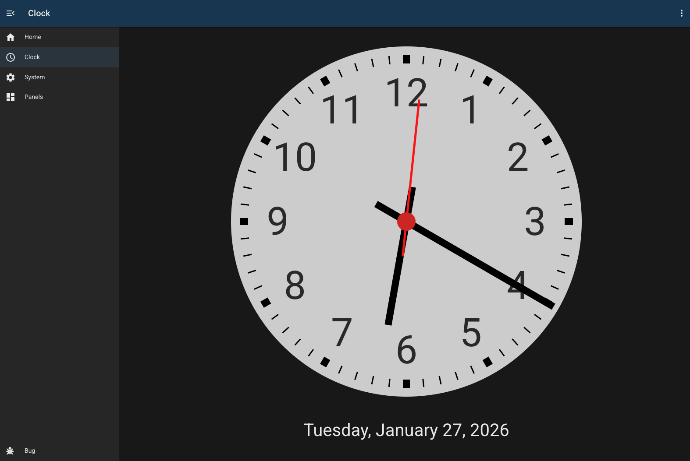
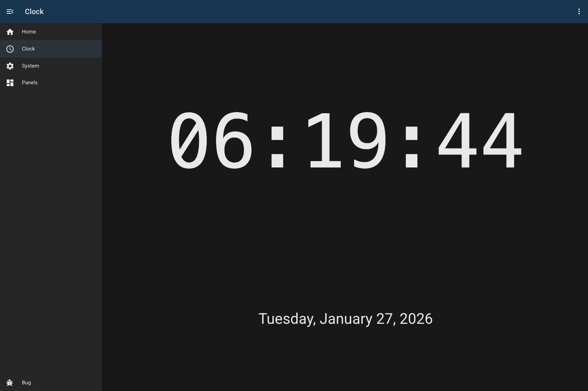

# Clock

## Overview

This simple clock module provides analogue and digital display of the current time.

> NOTE: The clock module uses the browser's local time, not the time on the BUG server.

## Configuration

| Field             | Default Value      | Description                                                          |
| ----------------- | ------------------ | -------------------------------------------------------------------- |
| `id`              | `""`               | Unique identifier for this module instance (usually auto-generated). |
| `needsConfigured` | `true`             | Indicates whether the module has been configured since build.        |
| `title`           | `""`               | Human-readable title for this module instance, shown in the UI.      |
| `module`          | `"mikrotik-sdwan"` | Internal name of the module.                                         |
| `type`.           | `"digital"`        | Whether to display an analogue digital display                       |
| `description`     | `""`               | Optional text describing the module instance in the UI.              |
| `group`.          | `""`               | The group this module instance                                       |
| `enabled`         | `false`            | Flag indicating whether this module instance is active.              |

---

## Device Configuration

None - this is a client-side module only.

---

## Troubleshooting
