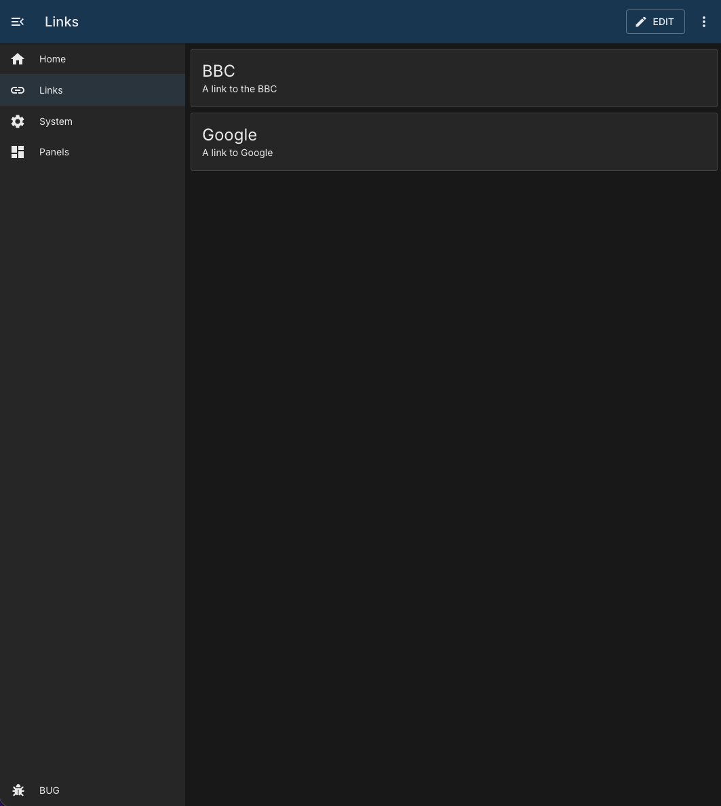

# Links

## Overview

The Links module provides a simple panel of cards that open external URLs.

This is a client-only module:

- No module container
- No API routes, services, or workers under this module
- Link data is stored in panel configuration



## Behaviour Modes

Each link supports one of three open behaviors:

| Value    | Label                     | Result                                          |
| -------- | ------------------------- | ----------------------------------------------- |
| `new`    | Open link in new tab      | Opens the URL in a new browser tab/window.      |
| `same`   | Open link over this tab   | Replaces the current page with the URL.         |
| `inside` | Open link within this tab | Navigates to the module's internal iframe view. |

## Configuration

Default panel configuration from `module.json`:

```json
{
    "id": "",
    "order": 0,
    "needsConfigured": false,
    "title": "",
    "module": "links",
    "description": "",
    "notes": "",
    "enabled": false,
    "links": []
}
```

### Link Item Shape

Each item in `links` should follow this shape:

```json
{
    "title": "Example",
    "description": "Human-friendly summary",
    "url": "https://example.com",
    "behaviour": "new"
}
```

## Notes

- Edit mode uses a dialog to create and update link items.
- The embedded link view supports closing via the close button or `Esc`.
- If an invalid link index is visited, the module shows a "Link not Found" state.
