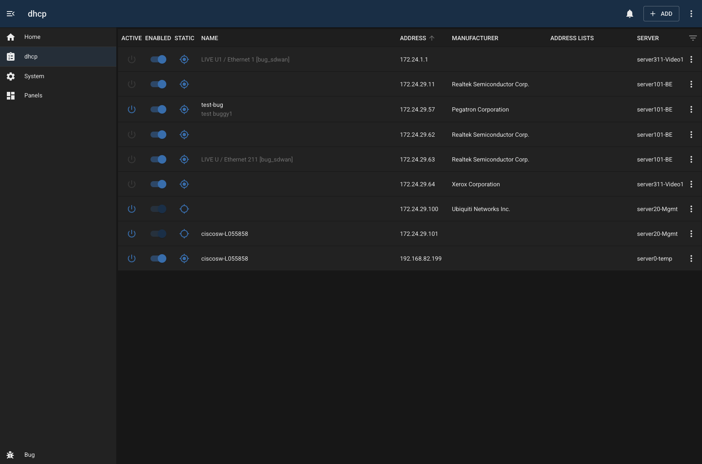
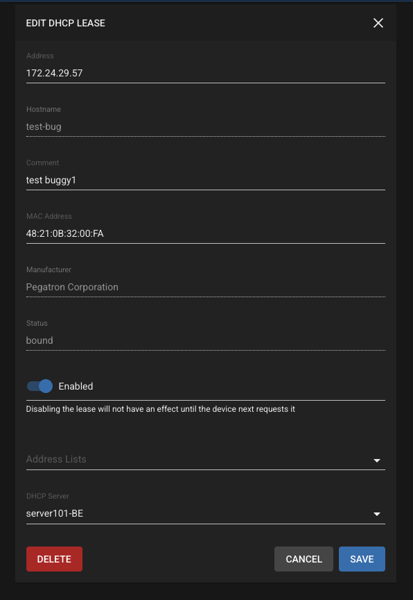

# Mikrotik DHCP

## Overview

The mikrotik-dhcp module provides visibilty and management of the DHCP lease table on a mikrotik router.

### Features

- view dynamic/static status, and lease active state
- enable/disable leases
- sort by address, manufacturer, server
- specify address list for each lease from dropdown
- auto lookup manufacturer using MAC address
- filter by various fields

## Configuration

| Field             | Default Value     | Description                                                          |
| ----------------- | ----------------- | -------------------------------------------------------------------- |
| `id`              | `""`              | Unique identifier for this module instance (usually auto-generated). |
| `needsConfigured` | `true`            | Indicates whether the module has been configured since build.        |
| `title`           | `""`              | Human-readable title for this module instance, shown in the UI.      |
| `module`          | `"mikrotik-dhcp"` | Internal name of the module.                                         |
| `description`     | `""`              | Optional text describing the module instance in the UI.              |
| `notes`           | `""`              | Free-text field for extra notes about this configuration.            |
| `address`         | `""`              | IP address or hostname of the MikroTik router to connect to.         |
| `username`        | `"bug"`           | Username used to authenticate with the MikroTik router.              |
| `password`        | `""`              | Password for the router user.                                        |
| `enabled`         | `false`           | Flag indicating whether this module instance is active.              |

---

## Capabilities

This module follows BUG’s standard capabilities model. For more information, see [BUG Capabilities Documentation]({DOCS_BASEURL}bug/pages/development/capabilities.html).

| Type         | List        |
| ------------ | ----------- |
| **Exposes**  | dhcp-server |
| **Consumes** | None        |

---

## Troubleshooting
