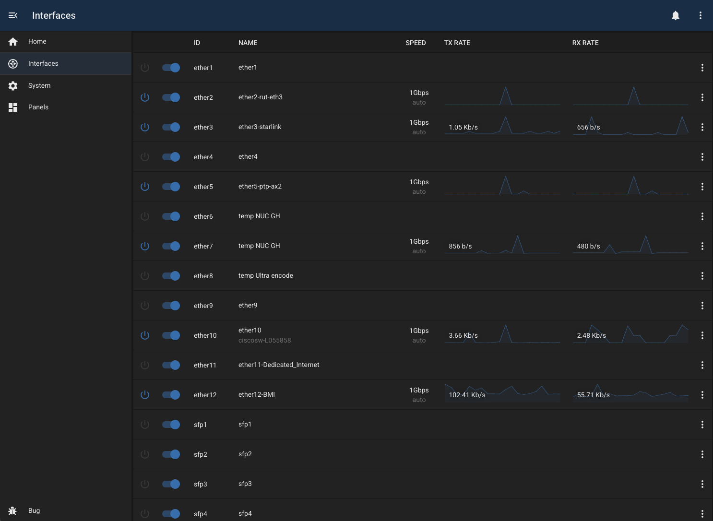

# Mikrotik Interfaces

## Overview

The mikrotik-interfaces module provides a simple list of available ethernet interfaces, with basic control and monitoring.

### Features

- enable/disable interfaces
- protect interfaces (by name or wildcard)
- rename (add comment)
- view TX/RX information
- view interface speed
- view LLDP information for each interface

## Configuration

| Field             | Default Value           | Description                                                          |
| ----------------- | ----------------------- | -------------------------------------------------------------------- |
| `id`              | `""`                    | Unique identifier for this module instance (usually auto-generated). |
| `needsConfigured` | `true`                  | Indicates whether the module has been configured since build.        |
| `title`           | `""`                    | Human-readable title for this module instance, shown in the UI.      |
| `module`          | `"mikrotik-interfaces"` | Internal name of the module.                                         |
| `description`     | `""`                    | Optional text describing the module instance in the UI.              |
| `notes`           | `""`                    | Free-text field for extra notes about this configuration.            |
| `address`         | `""`                    | IP address or hostname of the MikroTik router to connect to.         |
| `username`        | `"bug"`                 | Username used to authenticate with the MikroTik router.              |
| `password`        | `""`                    | Password for the router user.                                        |
| `enabled`         | `false`                 | Flag indicating whether this module instance is active.              |

---

## Capabilities

This module follows BUG’s standard capabilities model. For more information, see [BUG Capabilities Documentation]({DOCS_BASEURL}bug/pages/development/capabilities.html).

| Type         | List |
| ------------ | ---- |
| **Exposes**  | None |
| **Consumes** | None |

---

## Troubleshooting
