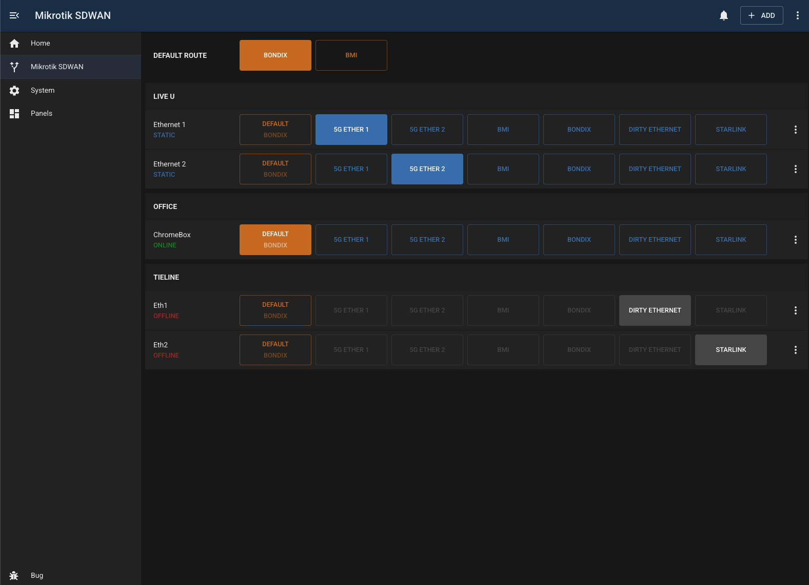

# <ModuleName>

## Overview

The mikrotik-sdwan module provides simple, rule-based traffic steering on a MikroTik router. It allows users to explicitly choose which WAN a device or service should use, using MikroTik address lists, mangle rules, and routes under the hood.

IP addresses can be added manually or selected from the router’s DHCP lease list, then organised into logical groups. This makes it easy to manage multi-interface devices such as LiveU units or Tieline gateways, where each interface can be routed independently.

WANs exposed in the UI are simply MikroTik route tables. Route tables are labelled using their comments on the router; tables without a comment are ignored. Updating a comment immediately updates the label shown in the module.

When a WAN is selected for an IP address, the module creates the required address list entry to steer traffic via the chosen route table. Selecting the default WAN removes this entry, returning traffic to normal routing behaviour. If an IP address was sourced from DHCP, the module also displays whether the lease is currently active.

## Configuration

| Field                | Default Value      | Description                                                          |
| -------------------- | ------------------ | -------------------------------------------------------------------- |
| `id`                 | `""`               | Unique identifier for this module instance (usually auto-generated). |
| `needsConfigured`    | `true`             | Indicates whether the module has been configured since build.        |
| `title`              | `""`               | Human-readable title for this module instance, shown in the UI.      |
| `module`             | `"mikrotik-sdwan"` | Internal name of the module.                                         |
| `description`        | `""`               | Optional text describing the module instance in the UI.              |
| `notes`              | `""`               | Free-text field for extra notes about this configuration.            |
| `routingTablePrefix` | `"r-tab"`          | Prefix used when naming MikroTik routing tables for this module.     |
| `address`            | `""`               | IP address or hostname of the MikroTik router to connect to.         |
| `username`           | `"bug"`            | Username used to authenticate with the MikroTik router.              |
| `password`           | `""`               | Password for the router user.                                        |
| `enabled`            | `false`            | Flag indicating whether this module instance is active.              |

---

## Capabilities

This module follows BUG’s standard capabilities model. For more information, see [BUG Capabilities Documentation](https://bbc.github.io/bug/pages/development/capabilities.html).

| Type         | List |
| ------------ | ---- |
| **Exposes**  | None |
| **Consumes** | None |

---

## Troubleshooting

#### Missing/incorrect WANs

Make sure the routing table prefix is set correctly and your routing tables are named appropriately.
