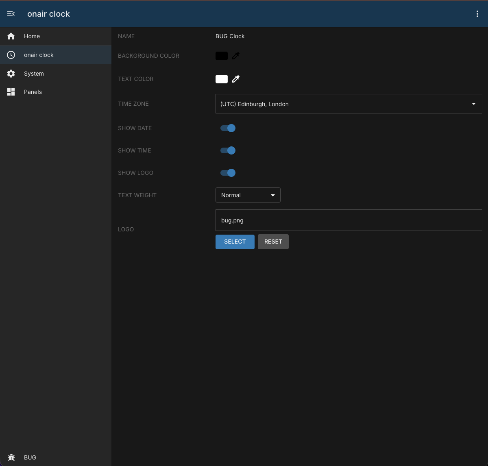
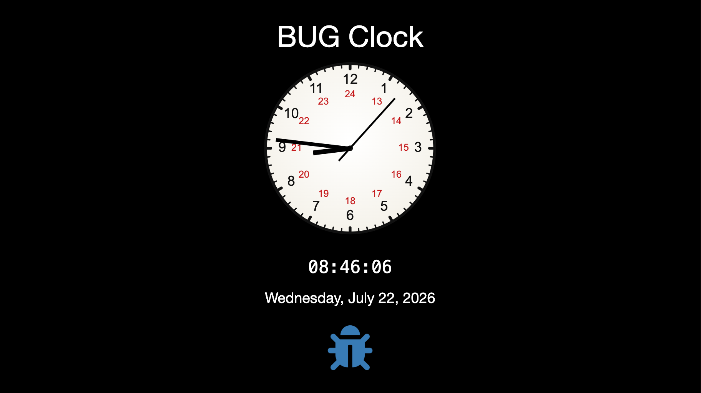
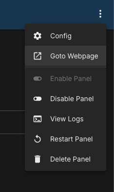

# On-Air Clock

## Overview

The on-air-clock module provides a broadcast-friendly analogue + digital clock page for use in HTML renderers such as OBS or CasparCG.

It includes:

- A custom SVG analogue clock face with 12-hour outer labels and 24-hour inner labels.
- A digital time display.
- Optional date and logo display.
- Runtime styling controls (header text, colors, text weight).
- Configurable timezone using IANA timezone identifiers.

## How to use

Use the public clock page route for playout:

- `/clock/large`
  This is also available via the panel menu:

This page is intended to be consumed by the renderer (for example as a browser source in OBS).

## Configuration

Instance-level configuration fields:

| Field             | Default                                                    | Description                                                    |
| ----------------- | ---------------------------------------------------------- | -------------------------------------------------------------- |
| `id`              | `""`                                                       | Unique instance id.                                            |
| `order`           | `0`                                                        | Display order of this instance.                                |
| `needsConfigured` | `false`                                                    | Indicates whether first-time setup is required.                |
| `title`           | `""`                                                       | Human-readable panel title.                                    |
| `module`          | `"onair-clock"`                                            | Internal module name.                                          |
| `description`     | `"A Clock that can be used in an HTML5 Graphics Renderer"` | Instance description.                                          |
| `notes`           | `""`                                                       | Optional free-text notes.                                      |
| `enabled`         | `false`                                                    | Enables/disables this instance.                                |
| `header`          | `"BUG Clock"`                                              | Text shown above the clock.                                    |
| `backgroundColor` | `"#000000"`                                                | Page background color.                                         |
| `textColor`       | `"#ffffff"`                                                | Header/date/time text color.                                   |
| `fontWeight`      | `"400"`                                                    | Weight used for header/date/time text.                         |
| `showTime`        | `true`                                                     | Show or hide the digital time.                                 |
| `showDate`        | `true`                                                     | Show or hide the date text.                                    |
| `showLogo`        | `true`                                                     | Show or hide the logo image.                                   |
| `timezone`        | See `module.json`                                          | Timezone object used to render both analogue and digital time. |
| `logo`            | See `module.json`                                          | Logo payload (`name` and base64 `image`).                      |

Notes:

- Time rendering uses the configured timezone (`timezone.utc[0]`) and not the host browser local time.

## API routes

Container API routes:

| Method | Route              | Description                          |
| ------ | ------------------ | ------------------------------------ |
| `GET`  | `/api/config`      | Return current module configuration. |
| `PUT`  | `/api/config`      | Update module configuration.         |
| `GET`  | `/api/status`      | Return module status payload.        |
| `ALL`  | `/api/clock/large` | Return the clock HTML page.          |
