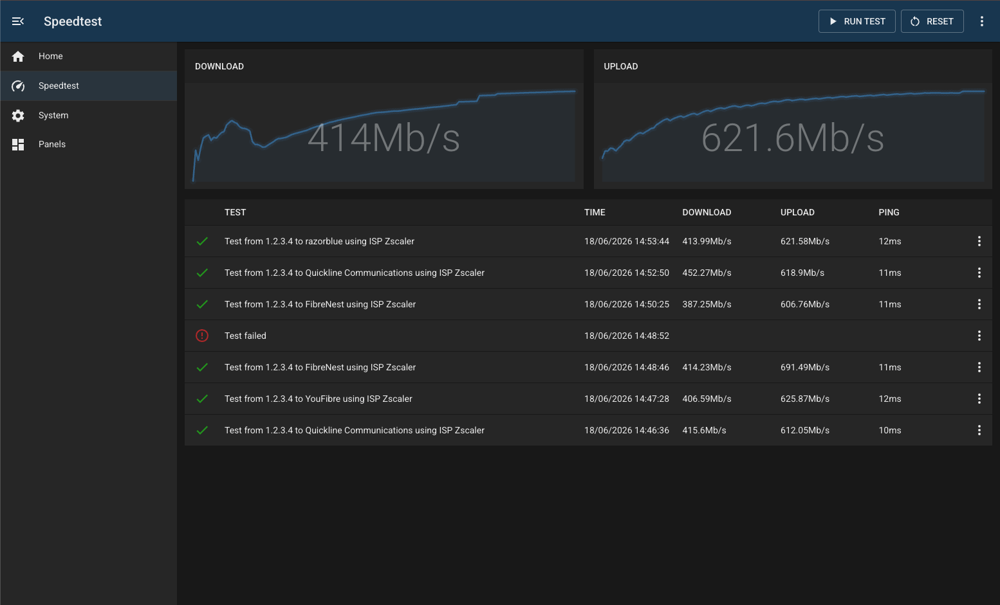

# Speedtest.net

## Overview

The speedtest-net module runs internet speed tests from your server and displays live download/upload graphs alongside a history of test results.

### Features

- run a manual speed test on demand
- schedule automatic periodic tests at a configurable interval
- live countdown (mm:ss) to the next scheduled test shown in the results table
- real-time download and upload sparkline graphs during a running test
- results table showing test summary, timestamp, download/upload/ping speeds
- automatic detection and marking of failed or timed-out tests
- reset graph data without deleting historical results
- delete all historical test results

## Configuration

| Field             | Default Value     | Description                                                                                   |
| ----------------- | ----------------- | --------------------------------------------------------------------------------------------- |
| `id`              | `""`              | Unique identifier for this module instance (usually auto-generated).                          |
| `needsConfigured` | `false`           | Indicates whether the module has been configured since build.                                 |
| `title`           | `""`              | Human-readable title for this module instance, shown in the UI.                               |
| `module`          | `"speedtest-net"` | Internal name of the module.                                                                  |
| `description`     | `""`              | Optional text describing the module instance in the UI.                                       |
| `notes`           | `""`              | Free-text field for extra notes about this configuration.                                     |
| `periodicTesting` | `false`           | Enable automatic scheduled speed tests.                                                       |
| `interval`        | `10`              | How often to run a test (in minutes) when periodic testing is on. Must be between 1 and 3600. |
| `enabled`         | `false`           | Flag indicating whether this module instance is active.                                       |

---

## Capabilities

This module follows BUG's standard capabilities model. For more information, see [BUG Capabilities Documentation]({DOCS_BASEURL}bug/pages/development/capabilities.html).

| Type         | List |
| ------------ | ---- |
| **Exposes**  | None |
| **Consumes** | None |

---

## Toolbar Actions

| Action     | Description                                                                                          | Disabled when                                                          |
| ---------- | ---------------------------------------------------------------------------------------------------- | ---------------------------------------------------------------------- |
| Run Test   | Starts a manual speed test. If periodic testing is active, also resets the periodic countdown timer. | A test is already running                                              |
| Reset      | Clears the current download/upload graph data.                                                       | Periodic testing is active, a test is running, or no graph data exists |
| Delete All | Deletes all historical test results.                                                                 | A test is running                                                      |

---

## Results Table

While a test is scheduled or running, a live status row appears at the top of the table:

- hourglass icon with `Next test starting in mm:ss` countdown
- spinning icon with `Test running mm:ss` elapsed time

Each completed result row shows:

| Column   | Description                                                                           |
| -------- | ------------------------------------------------------------------------------------- |
| (icon)   | Tick (completed), error (failed/timed out)                                            |
| TEST     | `Test from {publicIP} to {server} using ISP {ISP}`, or `Test failed` for errored runs |
| Time     | Date and time the test ran (`dd/mm/yyyy hh:mm:ss`)                                    |
| Download | Peak download speed (Mb/s)                                                            |
| Upload   | Peak upload speed (Mb/s)                                                              |
| Ping     | Latency (ms)                                                                          |

---

## Troubleshooting

**Test results show "Test failed"**

The test did not complete. This can happen if the speedtest binary cannot reach the internet, or if the container process was restarted while a test was running. Tests that have been in a running state for more than 45 seconds are automatically marked as failed on the next status check.

**Periodic tests are not running**

Ensure `periodicTesting` is enabled in the panel configuration and the `interval` value is set. The worker restarts when either of these config values changes, so the first test will run after one full interval has elapsed.

**Countdown disappears but no test starts**

This can happen if the container restarts exactly as a test is due. The scheduler will resume after the worker restarts and will wait one full interval before the next run.
